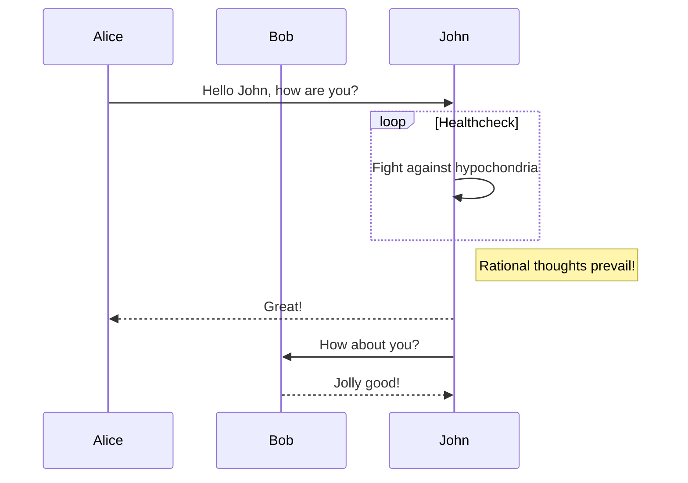

# Mermaid
Mermaid是一种编写甘特图、流程图、顺序图等各种图形的语法和解析库，通过这种语法，我们可以直接在markdown中编写各种图形，插件会对mermaid做解析输出。

下面就简单例子，具体更多写法就参考文档吧，[mermaid官方文档](https://mermaid-js.github.io/mermaid/#/flowchart)。

## 举个栗子

代码长这样

```
sequenceDiagram
    participant Alice
    participant Bob
    Alice->>John: Hello John, how are you?
    loop Healthcheck
        John->>John: Fight against hypochondria
    end
    Note right of John: Rational thoughts prevail!
    John-->>Alice: Great!
    John->>Bob: How about you?
    Bob-->>John: Jolly good!
```

效果是这样

